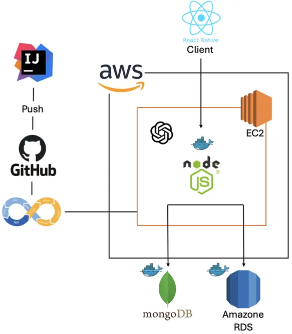
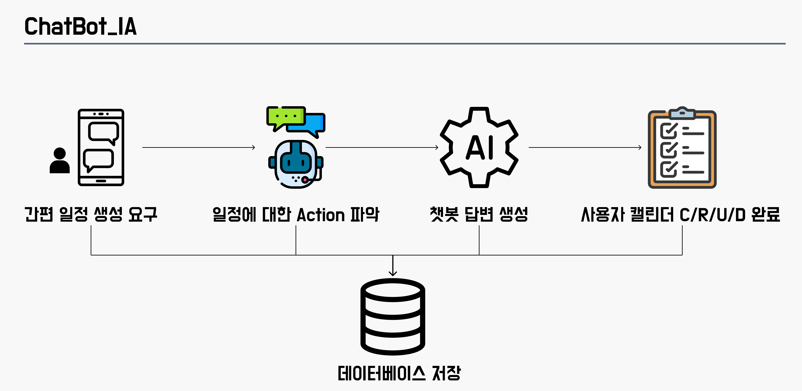

#  Plannie

**기간:** 2024.10 ~ 2024.11

생성형 AI 기반 맞춤형 공부 일정 관리 모바일 애플리케이션

---

## 🗒️ 개요
많은 학생들이 학습 목표와 일정을 효과적으로 관리하지 못해 학습 효율성이 떨어지고 있습니다.  
기존의 달력 애플리케이션 또는 일정 관리 도구는 단순한 알림 기능만 제공하며, 학습 내용을 세부적으로 관리하는 기능이 부족합니다.

또한, 학습 목표 달성률이나 학습 진도를 체계적으로 추적할 수 있는 도구가 부족하여 학생들은 스스로 학습 진도를 체크해야 하며 많은 시간을 소모합니다.  
이를 간편히 해결할 수 있도록 **생성형 AI 기반 학습 일정 관리 애플리케이션**을 제작하였습니다.

---

## 🌈 목표
- 효율적 일정 관리의 어려움 해소
- 학습 진도 및 성과 추적의 한계 극복 → 일정 효율성 극대화
- 개인 맞춤형 학습 지원 제공 → 생성형 AI를 통한 일정 관리 및 생성

---

## 📲 주요 기능
- 사용자 입력 정보를 기반으로 **생성형 AI가 학습 계획 생성 및 제안**
- 구체적인 학습 목표 설정 및 진행 상황 추적
- 파인튜닝된 OpenAI 모델을 통해 요청의 Action(생성, 조회, 삭제, 수정) 분류
- **캘린더 기능**으로 월별 일정 확인 및 목표 달성률 시각화

---

## 🧑🏻‍💻 팀 내 역할
- **인원:** 3명
- **담당 역할:**
    - 풀스택 엔지니어
    - OpenAI 파인튜너
    - 인프라 엔지니어

---

## 🔧 아키텍처 설계도

---

## 📜 License
This project is licensed under the MIT License - see the [LICENSE](./LICENSE) file for details.

© 2025 YOOChanHyuk
